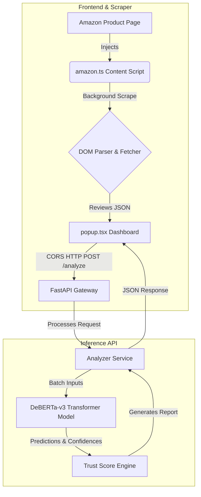

# DeceptiScan 🛡️🔍

[](#)
[](LICENCE)
[](#)
[](#)
[](#)

**DeceptiScan** is a premium, AI-powered browser extension and machine learning platform designed to detect fake, AI-generated, and manipulative product reviews on e-commerce sites in real-time. By bridging a **React + Plasmo** extension frontend with a **FastAPI + PyTorch (DeBERTa-v3)** inference backend, DeceptiScan calculates an actionable Trust Score, details review patterns, and provides explainable AI insights for safer shopping.

---

## 🌟 Key Features

### 💻 Premium Glassmorphic Dashboard
*   **Intuitive UI**: A sleek dark/light theme-adaptive pop-up window built with glassmorphism design principles.
*   **Trust Score Gauge**: Visualizes seller/product reliability using an animated circular gauge.
*   **Tabbed Analytics**:
    *   **Overview**: Summary of scraped reviews, product metadata, and final sentiment rating.
    *   **Reviews**: Labeled feed of reviews (marked as *Genuine*, *Suspicious*, or *Highly Fake*) with prediction confidence percentages.
    *   **Signals**: Breakdowns of warning triggers (such as review count discrepancies or abnormal distributions).
    *   **Settings**: Adjustable connection settings (e.g., configuring local/remote server endpoints).

### 🕷️ Smart Scraper (Anti-Bot & Dynamic)
*   **Deep Scrape**: Asynchronously crawls up to 5 paginated pages of reviews directly from Amazon product listings.
*   **Anti-Detection Jitter**: Employs randomized delay intervals (700ms - 1500ms) and cookie-integrated fetch requests to query pages without triggering CAPTCHAs or IP blocks.
*   **DOM Parsing**: Parses raw HTML dynamically without relying on brittle selector dependencies, collecting reviewer details, ratings, titles, and body texts.

### 🧠 Fine-Tuned NLP Classification Backend
*   **Primary Classifier**: Houses a fine-tuned DeBERTa-v3 sequence classification transformer model optimized on over 72,000 labeled review datasets.
*   **Multi-Core & GPU Acceleration**: Automatically routes inference tasks to PyTorch CUDA cores for lightning-fast inference (< 200ms per batch).
*   **Explainable Trust Score**: Weighs classification confidence alongside rating distributions and suspicious reviewer behaviors to output a single, comprehensive percentage.

---

## 🏗️ System Architecture



---

## 📂 Project Structure

```ascii
Deceptiscan/
├── .github/                       # GitHub actions pipelines
│   └── workflow/                  # CI/CD test automation for backend and extension
├── LICENCE                        # MIT License
├── README.MD                      # Project Documentation
├── github_upload_guide.md         # Upload & Repository Management Guide
└── extension/                     # Chrome Extension Workspace
    ├── assets/                    # Static image resources and extension icon
    ├── contents/                  # Content scripts (Amazon scraper injection)
    ├── lib/                       # Utility scripts & API request handlers
    ├── popup.tsx                  # Main dashboard React popup UI code
    ├── tsconfig.json              # TypeScript compilation setup
    └── backend/                   # FastAPI NLP Inference API
        ├── app/                   
        │   ├── main.py            # FastAPI Entry Point (Uvicorn Gateway)
        │   ├── api/routes/        # Endpoint routes (Analyze, Health, Reviews)
        │   ├── core/              # Global configurations & constants
        │   ├── schemas/           # Pydantic Request & Response models
        │   └── services/          # Inference orchestration & Trust Score calculations
        ├── training/              # Training scripts and evaluation Jupyter Notebooks
        ├── requirements.txt       # Python Dependencies list
        └── s.DockerFile           # Backend container build instructions
```

---

## 🚀 Getting Started

Follow these instructions to install, build, and run the complete DeceptiScan suite locally.

### Prerequisites
*   [Node.js](https://nodejs.org/) (v18 or higher recommended)
*   [Python 3.10+](https://www.python.org/)
*   Google Chrome (or any Chromium-based browser)

---

### Step 1: Install & Launch the Extension (Frontend)

1.  Navigate into the extension directory:
    ```bash
    cd extension
    ```
2.  Install dependencies:
    ```bash
    npm install
    ```
3.  Start the Plasmo developer development server:
    ```bash
    npm run dev
    ```
4.  Open Google Chrome and go to `chrome://extensions/`.
5.  Enable **Developer mode** using the toggle switch in the top-right corner.
6.  Click **Load unpacked** in the top-left and select the directory:
    `Deceptiscan/extension/build/chrome-mv3-dev`
7.  The DeceptiScan icon will now appear in your extension toolbar!

---

### Step 2: Set Up & Launch the Inference Server (Backend)

1.  Navigate to the backend directory:
    ```bash
    cd extension/backend
    ```
2.  Create and activate a virtual environment:
    ```bash
    python -m venv .venv

    # On Windows (PowerShell/CMD)
    .venv\Scripts\activate

    # On macOS/Linux
    source .venv/bin/activate
    ```
3.  Install the backend Python dependencies:
    ```bash
    pip install -r requirements.txt
    ```
4.  **Download and Place Model Weights**:
    Since model weights are not uploaded to GitHub due to size limitations, ensure your fine-tuned model folder `deberta-v3-detector` is placed in:
    `extension/backend/models/deberta-v3-detector/`
    *(Ensure it contains `model.safetensors`, `config.json`, `tokenizer.json`, etc.)*
5.  Start the FastAPI Server:
    ```bash
    python app/main.py
    ```
    The server will startup at `http://localhost:8000`. You can test it by visiting the Swagger Docs at `http://localhost:8000/docs`.

---

## 📊 Dataset & Model Details

The model was fine-tuned on a merged, deduplicated, and cleaned corpus of e-commerce reviews:

*   **Total Labeled Samples**: 72,877
*   **Training Split**: 57,325 reviews
*   **Testing Split**: 14,332 reviews
*   **Primary Architecture**: `DeBERTa-v3` base sequence classifier

### Performance Metrics
*   **Baseline XGBoost Accuracy**: ~84.2%
*   **Fine-Tuned DeBERTa-v3 Accuracy**: **~96.8%**
*   **Average Batch Inference Latency**: ~12ms per review (on CUDA GPU)

---

## 🛡️ License

Distributed under the MIT License. See [LICENCE](LICENCE) for details.
